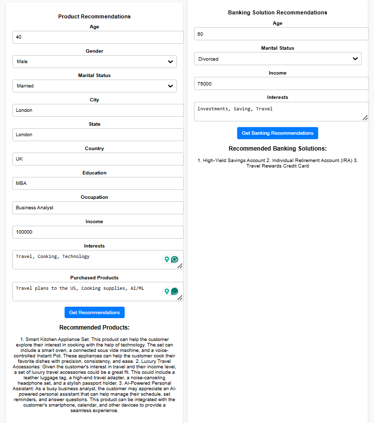

# 🚀 SmartSuggest : A Recommendation System

## 📌 Table of Contents
- [Introduction](#introduction)
- [Demo](#demo)
- [Inspiration](#inspiration)
- [What It Does](#what-it-does)
- [How We Built It](#how-we-built-it)
- [Challenges We Faced](#challenges-we-faced)
- [How to Run](#how-to-run)
- [Tech Stack](#tech-stack)
- [Team](#team)

---

## 🎯 Introduction
SmartSuggest is an advanced AI-powered recommendation system designed to provide personalized product suggestions, tailored banking solutions, and curated content recommendations based on user preferences, behavior, and demographic data.

By leveraging an approach that makes use of generative AI, SmartSuggest delivers highly relevant and data-driven insights to enhance user decision-making across multiple domains.

Whether assisting with smart shopping, financial planning, or content discovery, or even career progression advice, SmartSuggest ensures that every recommendation is optimized to align with individual needs and interests.

## 🎥 Demo
🔗 [Live Demo](#) (if applicable)  
📹 [Video Demo](#) Attached in artifacts  
🖼️ Screenshots:

![Screenshot 1] 

## 💡 Inspiration
In today's world, users are overwhelmed with choices and often struggle to decide what suits them best. This challenge inspired me to develop this application. While recommendation systems are widely used for product suggestions and content recommendations, there are still gaps in areas like personalized banking solutions and career progression advice. These niche domains lack robust recommendation engines that can guide users in making informed financial decisions or navigating their career growth. My system was designed to bridge this gap, providing AI-powered, data-driven recommendations to help users make smarter choices in their financial and professional journeys.

## ⚙️ What It Does
The application leverages Mistral-AI to generate intelligent recommendations across multiple domains. It comprises an Angular-based frontend and a Python-powered backend that seamlessly interact to deliver personalized suggestions.

Users engage with the system through the Angular UI, which processes their input and forwards structured prompts to the Python API. The backend, in turn, communicates with Mistral-AI, generating tailored recommendations based on user data.

The application integrates four distinct recommendation systems, offering personalized insights for:
✔ Product Recommendations – Suggests relevant products based on user preferences and purchase history.
✔ Career Progression – Identifies optimal career transitions based on current job, experience, and interests.
✔ Banking Solutions – Recommends suitable financial products aligned with the user's financial profile.
✔ Content Suggestions – Provides personalized book, movie, and TV show recommendations.

By combining AI-driven insights with a user-friendly interface, the application delivers highly personalized and data-driven recommendations, enhancing decision-making across various domains.

## 🛠️ How We Built It
The application is developed using FastAPI (Python) for the backend and Angular for the frontend, providing a scalable and interactive user experience.

Initially, the goal was to integrate traditional recommendation models with Generative AI (Gen-AI) to enhance recommendation quality. However, challenges in generating realistic synthetic data led to a shift towards a fully AI-driven approach using Mistral-AI for personalized recommendations.

For development, PyCharm and Visual Studio Code were used to build and debug the application. Additionally, Cypress was utilized for end-to-end testing, ensuring the reliability and accuracy of the recommendation system across different user interactions.

## 🚧 Challenges We Faced
The most significant and time-consuming challenge in developing the application was generating high-quality synthetic data. This data was created using Python scripts, which underwent multiple refinements to ensure it closely resembled real-world data.

The next major challenge was training a traditional machine learning model on this synthetic dataset. We initially experimented with pre-trained models like LightFM for recommendations. However, encoding the data proved to be complex—we had to balance preserving information while avoiding excessive features and sparsity.

After encoding, we attempted to train the model, but it struggled to learn meaningful patterns. The synthetic nature of the data caused the model to memorize past purchases, leading to recommendations that merely repeated previously bought items. Despite extensive efforts—including hyperparameter tuning, loss function modifications, and alternative encoding strategies—the recommendations did not improve significantly.

Ultimately, due to these limitations, we decided to transition entirely to a Generative AI-based approach using Mistral-AI, which provided more context-aware and personalized recommendations.

## 🏃 How to Run
1. Clone the repository  
   ```sh
   git clone https://github.com/ewfx/aidhp-tech-army.git
   ```
2. Install dependencies  
   ```sh
   open code/srcFrontEnd/recommendation-app in command prompt
   npm install
   
   open code/srcBackEnd folder in command prompt
   pip install -r requirements.txt
   ```
3. Run the project  
   ```sh
   open code/srcFrontEnd/recommendation-app in command prompt
   ng serve  # or python main.py

   open code/src folder in command prompt
   uvicorn BackEnd.main:app --reload --host 0.0.0.0 --port 8000 --log-level debug
   ```

4. Run the tests
   ```sh
   Make sure the backend and frontend are up and running succesfully
   
   open code/test folder
   npm install
   
   To run tests in headless mode: 
   npx cypress run

   To run tests manually from test runner: 
   npx cypress open
   ```

## 🏗️ Tech Stack
- 🔹 Frontend: Angular
- 🔹 Backend: FastAPI 
- 🔹 Testing: Cypress
- 🔹 Other: MistralAI - API

## 👥 Team
- Yadeeswaran K S - Yadeeswaran-KS (https://github.com/Yadeeswaran-KS) | Yadeeswaran K S (https://www.linkedin.com/in/yadeeswaran-k-s-91a79711a/)
- Shibasish Bhuyan 
- Pradeep Madaiah  
- Umapati Kuna 